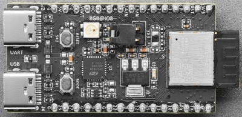

## ESP32-H2 Zigbee device
Following the excellent video from gammatroniques presenting the ESP32-H2 module for Zigbee device usage, I wanted to compile the information gathered about this module as well as its usage with Zigbee2MQTT.

The tests were conducted on the ESP32-H2-DevKitM-1 module
<br>

### Description



* [Schéma](./images/esp32-h2-devkitm-1_v1.2_schematics_20230306.pdf)

ESP32-H2-DevKitM-1 is an entry-level development board based on Bluetooth® Low Energy and IEEE 802.15.4 combo modules ESP32-H2-MINI-1. 
Most of the I/O pins on the ESP32-H2-MINI-1 module are broken out to the pin headers on both sides of this board for easy interfacing.

Developers can either connect peripherals with jumper wires or mount ESP32-H2-DevKitM-1 on a breadboard.

ESP32-H2 is an ultra-low-power Internet of Things (IoT) solution offering multiple protocol support on a single chip. It integrates a 2.4 GHz transceiver compliant with Bluetooth ® Low Energy and IEEE 802.15.4-based technologies, supporting Bluetooth 5 (LE), Bluetooth mesh, Thread, Matter, and **Zigbee**. It has:

- A Bluetooth LE subsystem that supports features of Bluetooth 5 and Bluetooth mesh
- An IEEE 802.15.4 subsystem that supports Thread and Zigbee
- Radio protocols coexistence in 2.4GHz band
- State-of-the-art power and RF performance
- 32-bit RISC-V single-core processor with a four-stage pipeline that operates at up to 96 MHz
- 320 KB of SRAM, 128 KB of ROM, 4 KB LP memory, and 4 MB SiP flash inside
- Reliable security ensured by:
    - Cryptographic hardware accelerators that support AES-128/256, Hash, RSA, HMAC, ECC, digital signature, and secure boot
    - Random number generator
    - Permission control on accessing internal memory, external memory, and peripherals
    - External memory encryption and decryption
- Rich set of peripheral interfaces and GPIOs, ideal for various scenarios and complex applications.

<br>

### Features

- ESP32-H2-MINI-1: ESP32-H2-MINI-1, with ESP32-H2 inside which integrates a 2.4 GHz transceiver compliant with Bluetooth ® Low Energy and IEEE 802.15.4-based technologies, supporting Bluetooth 5 (LE), Bluetooth mesh, Thread, Matter, and Zigbee. This module is specially designed for all kinds of low-power IoT applications.
- Pin Headers: All available GPIO pins (except for the SPI bus for flash) are broken out to the pin headers on the board. For details, please see Espressif's Header Block.
- 3.3V Power On LED: Turns on when the USB power is connected to the board.
- 5V to 3.3V LDO: Power regulator that converts a 5 V supply into a 3.3 V output.
- USB-to-UART Bridge: Single USB-UART bridge chip provides transfer rates up to 3 Mbps.
- ESP32-H2 USB Type-C Port: The USB Type-C port on the ESP32-H2 chip is compliant with USB 2.0 full speed. It is capable of up to 12 Mbps transfer speed (Note that this port does not support the faster 480 Mbps high-speed transfer mode).
- Boot Button: Download button. Holding down Boot and then pressing Reset initiates Firmware Download mode for downloading firmware through the serial port.
- Reset Button: Press this button to restart the system.
- USB Type-C to UART Port: Power supply for the board as well as the communication interface between a computer and the ESP32-H2 chip via USB-to-UART bridge.
- RGB LED: Addressable RGB LED, driven by GPIO8.
- J5: Used for current measurement. See details in Section Current Measurement.

<br>

### Pinout


<br>

### Documentations

* Zigbee:
    - <https://beta.gammatroniques.fr/projects/esp32h2-zigbee>
    - Code
      - <https://github.com/xmow49/ESP32H2-Zigbee-Demo>
      - <https://github.com/xmow49/ESP32H2-SmokeDetector>
    - Shema gammatroniques
      - <https://api.gammatroniques.fr/uploads/projects/clm14zy211910701p6fwz96xbc/clm17af0t1938001p6452z3v8w.pdf>
    - <https://zigbeealliance.org/wp-content/uploads/2019/12/07-5123-06-zigbee-cluster-library-specification.pdf>
    - <https://csa-iot.org/wp-content/uploads/2022/01/docs-05-3474-22-0csg-zigbee-specification-1.pdf>

    - Doc esp32-h2
      - <https://docs.espressif.com/projects/espressif-esp-dev-kits/en/latest/esp32h2/esp32-h2-devkitm-1/user_guide.html>
      - <https://www.adafruit.com/product/5715>
      - <https://github.com/espressif/esp-zigbee-sdk>
      - <https://docs.espressif.com/projects/esp-zigbee-sdk/en/latest/esp32/introduction.html>
      - [Using zigbee with an ESP32-H2 and an ESP32-C6 to control a LED](https://www.youtube.com/watch?v=-iLCr0jXfp4)
      - [Use ESP32-H2 to Build Smart-Connected Devices from Different Ecosystems](https://www.youtube.com/watch?v=bS9Ch7k_GK0&list=PLOzvoM7_KnrdHvpvq_EQaxHMdSwRBCvtx)
      - [Using an ESP32-H2 to blink an LED](https://www.youtube.com/watch?v=4opeIxnTNXY)
      - [ESP32 C6 Review - RISC-V SoC with Thread & Zigbee Support!](https://www.youtube.com/watch?v=zqwZGWxJs-0)


<br>

### Programmation

### VsCode


* To install VSCode on Debian:

```Bash
  apt update
  curl https://packages.microsoft.com/keys/microsoft.asc | gpg --dearmor > microsoft.gpg
  install -o root -g root -m 644 microsoft.gpg /usr/share/keyrings/microsoft-archive-keyring.gpg
  sh -c 'echo "deb [arch=amd64,arm64,armhf signed-by=/usr/share/keyrings/microsoft-archive-keyring.gpg] https://packages.microsoft.com/repos/vscode stable main" > /etc/apt/sources.list.d/vscode.list'
  apt update
  apt install code
  apt install git wget flex bison gperf python3 python3-pip python3-venv cmake ninja-build ccache libffi-dev libssl-dev dfu-util libusb-1.0-0
```

Set up **VSCode**
 Install the Espressif IDF extension
 Choose the working directory with the example smoke_detector
 The ESP-IDF setup window appears
 Select the installation mode as advanced, branch master (dev branch), change the installation directory to /home/<user>/.local/esp
 Install (ignore errors related to tools)
 Download tools
 Message "All settings have been configured"
 Choose the ESP32 model => h2 in the status bar ESP-IDF set Expressif device target
 Launch in the status bar ESP-IDF Build project
 Select the module port in the status bar ESP-IDF select port to use
 Flash the module in the status bar ESP-IDF Flash device
  - 
See in ~/.local/esp/esp-idf/examples/zigbee/ for other examples of Zigbee test codes.

Serial Console Output:

```
ESP-ROM:esp32h2-20221101
Build:Nov  1 2022
rst:0x1 (POWERON),boot:0xc (SPI_FAST_FLASH_BOOT)
SPIWP:0xee
mode:DIO, clock div:1
load:0x408460e0,len:0x17ac
load:0x4083cfd0,len:0xdf4
load:0x4083efd0,len:0x2d84
entry 0x4083cfda
I (23) boot: ESP-IDF v5.2-dev-3287-g1ec70cd568 2nd stage bootloader
I (24) boot: compile time Oct 16 2023 16:01:44
I (25) boot: chip revision: v0.1
I (28) boot.esp32h2: SPI Speed      : 64MHz
I (33) boot.esp32h2: SPI Mode       : DIO
I (38) boot.esp32h2: SPI Flash Size : 2MB
I (42) boot: Enabling RNG early entropy source...
I (48) boot: Partition Table:
I (51) boot: ## Label            Usage          Type ST Offset   Length
I (59) boot:  0 nvs              WiFi data        01 02 00009000 00006000
I (66) boot:  1 phy_init         RF data          01 01 0000f000 00001000
I (74) boot:  2 factory          factory app      00 00 00010000 000a2800
I (81) boot:  3 zb_storage       Unknown data     01 81 000b3000 00004000
I (88) boot:  4 zb_fct           Unknown data     01 81 000b7000 00000400
I (96) boot: End of partition table
I (100) esp_image: segment 0: paddr=00010020 vaddr=42068020 size=106c0h ( 67264) map
I (129) esp_image: segment 1: paddr=000206e8 vaddr=40800000 size=07930h ( 31024) load
I (141) esp_image: segment 2: paddr=00028020 vaddr=42000020 size=62d04h (404740) map
I (265) esp_image: segment 3: paddr=0008ad2c vaddr=40807930 size=04d84h ( 19844) load
I (273) esp_image: segment 4: paddr=0008fab8 vaddr=4080c6c0 size=01420h (  5152) load
I (279) boot: Loaded app from partition at offset 0x10000
I (280) boot: Disabling RNG early entropy source...
I (294) cpu_start: Unicore app
W (304) clk: esp_perip_clk_init() has not been implemented yet
I (310) cpu_start: Pro cpu start user code
I (311) cpu_start: cpu freq: 96000000 Hz
I (311) cpu_start: Application information:
I (313) cpu_start: Project name:     on_off_light_bulb
I (319) cpu_start: App version:      3c7142e-dirty
I (325) cpu_start: Compile time:     Oct 16 2023 16:01:37
I (331) cpu_start: ELF file SHA256:  1c4fb2761...
I (336) cpu_start: ESP-IDF:          v5.2-dev-3287-g1ec70cd568
I (343) cpu_start: Min chip rev:     v0.0
I (347) cpu_start: Max chip rev:     v0.99
I (352) cpu_start: Chip rev:         v0.1
I (357) heap_init: Initializing. RAM available for dynamic allocation:
I (364) heap_init: At 40814260 len 00039120 (228 KiB): D/IRAM
I (371) heap_init: At 4084D380 len 00002B60 (10 KiB): STACK/DIRAM
I (378) spi_flash: detected chip: generic
I (382) spi_flash: flash io: dio
W (386) spi_flash: Detected size(4096k) larger than the size in the binary image header(2048k). Using the size in the binary image header.
I (399) sleep: Configure to isolate all GPIO pins in sleep state
I (406) sleep: Enable automatic switching of GPIO sleep configuration
I (413) main_task: Started on CPU0
I (413) main_task: Calling app_main()
I (413) DEMO: Domos: app_main call
I (433) DEMO: Domos: esp_zb_task call
I (443) phy: phy_version: 210,0, 11c334c, Sep  4 2023, 17:01:13
I (443) phy: libbtbb version: b821802, Sep  4 2023, 17:01:29
I (463) main_task: Returned from app_main()
I (473) DEMO: Domos: esp_zb_app_signal_handler call
I (473) DEMO: ZDO signal: ZDO Config Ready (0x17), status: ESP_FAIL
I (473) DEMO: Domos: esp_zb_app_signal_handler call
I (473) DEMO: Zigbee stack initialized
I (8713) DEMO: Domos: esp_zb_app_signal_handler call
I (8713) DEMO: Start network steering
I (8733) DEMO: Domos: esp_zb_app_signal_handler call
I (8733) DEMO: Joined network successfully (Extended PAN ID: 75:0f:88:c6:10:27:86:c6, PAN ID: 0xc31b, Channel:15)
I (8733) DEMO: Domos: button_task call
I (8743) DEMO: Domos: dht22_task call
E (458623) DHT: Sensor Timeout
I (488753) DEMO: Hum: 77.5 Tmp: 21.8
I (498623) DEMO: Hum: 77.6 Tmp: 21.8
...
I (618623) DEMO: Hum: 77.5 Tmp: 21.8
I (638343) DEMO: Button changed: 1
I (638413) DEMO: Button changed: 1
I (641613) DEMO: Button changed: 0
I (641643) DEMO: Button changed: 0
I (648753) DEMO: Hum: 77.4 Tmp: 21.8
...
I (288837) DEMO: Hum: 77.1 Tmp: 22.4
I (328837) DEMO: Hum: 77.2 Tmp: 22.5
I (359857) DEMO: Domos: zb_action_handler call        <== Switch activé dans l'interface Zigbee2MQTT
I (359857) DEMO: Domos: zb_attribute_handler call
I (359857) DEMO: Received message: endpoint(0xa), cluster(0x6), attribute(0x0), data size(1)
I (359867) DEMO: Light state = 1
I (359867) DEMO: Light sets to On
I (364337) DEMO: Domos: zb_action_handler call        <== Switch activé dans l'interface Zigbee2MQTT
I (364337) DEMO: Domos: zb_attribute_handler call
I (364337) DEMO: Received message: endpoint(0xa), cluster(0x6), attribute(0x0), data size(1)
I (364347) DEMO: Light state = 0
I (364347) DEMO: Light sets to Off
I (368127) DEMO: Domos: zb_action_handler call        <== Switch activé dans l'interface Zigbee2MQTT
I (368127) DEMO: Domos: zb_attribute_handler call
I (368127) DEMO: Received message: endpoint(0xa), cluster(0x6), attribute(0x0), data size(1)
I (368137) DEMO: Light state = 1
I (368137) DEMO: Light sets to On
I (368837) DEMO: Hum: 77.3 Tmp: 22.4
I (408837) DEMO: Hum: 77.0 Tmp: 22.4
```
*  **Erase the flash**

If the code changes completely, it will be necessary to erase the module's flash and remove the device from Zigbee2MQTT.

In VSCode, with the project folder open, navigate to the VSCode terminal."

```
$ idf.py -p /dev/ttyUSB0 erase-flash
...
Serial port /dev/ttyUSB0
Connecting....
Chip is ESP32-H2 (revision v0.1)
Features: BLE, IEEE802.15.4
Crystal is 32MHz
MAC: 48:31:b7:ff:fe:c0:6c:3b
BASE MAC: 48:31:b7:c0:6c:3b
MAC_EXT: ff:fe
Uploading stub...
Running stub...
Stub running...
Changing baud rate to 460800
Changed.
Erasing flash (this may take a while)...
Chip erase completed successfully in 1.6s
Hard resetting via RTS pin...
Done
```
It is possible to execute the command idf.py outside of **VSCode**.

`/home/<user>/.espressif/python_env/idf5.2_py3.11_env/bin/python /home/<user>/.local/esp/esp-idf/tools/idf.py`

**   Zigbee2MQTT   **
Tested on Zigbee2MQTT installed on Raspberry-Pi 3B with the PiZigate coordinator using the code from https://github.com/xmow49/ESP32H2-Zigbee-Demo flashed onto the ESP32-H2,

This program exposes the temperature and humidity from a DHT22, the state of a GPIO input with a push button, and an output connected to a LED. The parameters ManufacturerName, ModelIdentifier, DateCode have been changed in the code, and logs have been added to track the operation (I (xxxxx) DEMO: Domos: ...).

After the pairing, which occurs at the module's boot, the device appears in Zigbee2MQTT as device 0x4831b7fffec06c3b "Unsupported."


It is possible to query the **device** in the Dev Console of **Zigbee2MQTT** and obtain the exposed clusters:

```
info 2023-10-09 18:34:48  Read result of 'genBasic': {"manufacturerName":"GammaTroniques","hwVersion":2,"appVersion":1,"modelId":"Demo","dateCode":"20230826"}
info 2023-10-16 17:33:06  Read result of 'genIdentify': {"identifyTime":0}
info 2023-10-16 17:34:32  Read result of 'genOnOff': {"onOff":0}
info 2023-10-16 17:30:51  Read result of 'genBinaryInput': {"presentValue":0,"statusFlags":0}
info 2023-10-16 17:36:20  Read result of 'msTemperatureMeasurement': {"measuredValue":1840,"minMeasuredValue":-50,"maxMeasuredValue":100}
info 2023-10-16 17:37:42  Read result of 'msRelativeHumidity': {"measuredValue":6060,"minMeasuredValue":0,"maxMeasuredValue":100}
```


You need to follow the procedure on the 'Support new devices' page of the website https://www.zigbee2mqtt.io for the device to be recognized.

The Zigbee2MQTT log provides information on the type of cluster to declare:"

```
zigbee2mqtt    | Zigbee2MQTT:debug 2023-10-20 16:43:20: Received Zigbee message from '0x4831b7fffec06c3b', type 'attributeReport', cluster 'genBinaryInput', data '{"presentValue":0}' from endpoint 10 with groupID null
zigbee2mqtt    | Zigbee2MQTT:debug 2023-10-20 16:43:20: No converter available for 'ESP32-H2_1' with cluster 'genBinaryInput' and type 'attributeReport' and data '{"presentValue":0}'
```
Add the file zigbee2mqtt-data/esp32-h2_1.js (external converter file) (drawing inspiration from the sources concerning the existing devices/converters on https://github.com/Koenkk/zigbee-herdsman-converters/tree/master/src)

```js
// https://github.com/Koenkk/zigbee-herdsman-converters/blob/master
const fz = require('zigbee-herdsman-converters/converters/fromZigbee');
const tz = require('zigbee-herdsman-converters/converters/toZigbee');
const exposes = require('zigbee-herdsman-converters/lib/exposes');
const reporting = require('zigbee-herdsman-converters/lib/reporting');
const extend = require('zigbee-herdsman-converters/lib/extend');
const e = exposes.presets;
const ea = exposes.access;

const definition = {
    zigbeeModel: ['DHT22_IO'], // The model ID from: Device with modelID 'lumi.sens' is not supported.
    model: 'ESP32-H2_1', // Vendor model number, look on the device for a model number
    vendor: 'vdomos', // Vendor of the device (only used for documentation and startup logging)
    description: 'ESP32-H2 Demo temperature & humidity sensor', // Description of the device, copy from vendor site. (only used for documentation and startup logging)
    fromZigbee: [fz.temperature, fz.humidity, fz.terncy_contact], // We will add this later
    toZigbee: [tz.on_off], // Should be empty, unless device can be controlled (e.g. lights, switches).
    exposes: [e.temperature(), e.humidity(), e.switch(), e.contact()], // Defines what this device exposes, used for e.g. Home Assistant discovery and in the frontend
};

module.exports = definition;
```
You need to add this line to zigbee2mqtt-data/configuration.yaml for it to take effect and restart **zigbee2mqtt**.


```yaml
advanced:
  log_level: debug
external_converters:
  - esp32-h2_1.js
```
The ESP32-H2 module is properly recognized, and the sensors/actuators are exposed in the **Zigbee2MQTT** interface after the file is taken into account:
 


